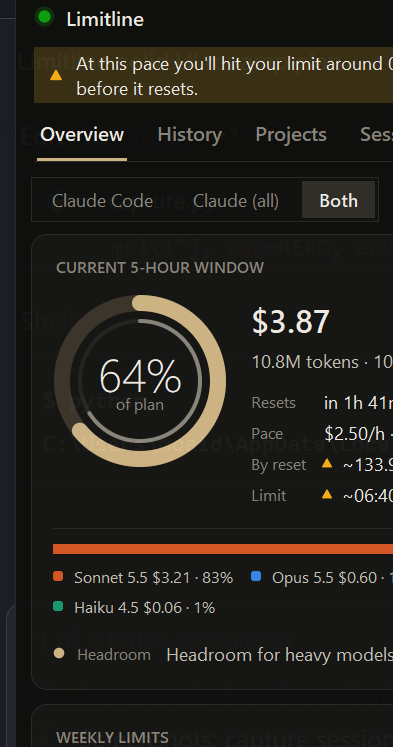
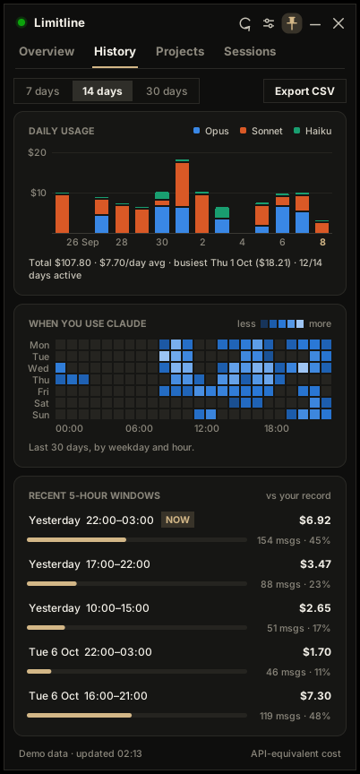
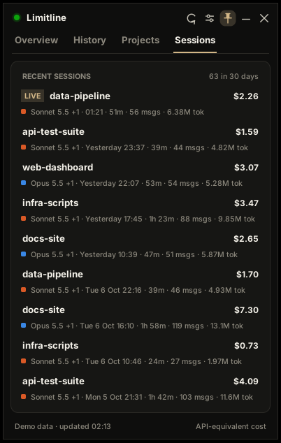

# Limitline

> **Unofficial.** Limitline is an independent community project. It is not made, endorsed or sponsored by Anthropic. "Claude" and "Claude Code" are Anthropic's trademarks, used here only to say which tool it works with.

A small floating desktop window that keeps your **Claude Code** usage in view: how much of the current 5-hour window and the weekly limits you've used, when they reset, how fast you're burning, and where you'll land.

One Python file. No dependencies beyond the standard library (tkinter) - the optional system-tray icon adds `pip install "limitline[tray]"` (pystray + Pillow) and stays off without it. Windows, macOS and Linux.



## Features

- **Privacy-First & Local:** Limitline is designed to be purely local. It does not send analytics or telemetry. The **Live plan limits** run via Claude Code's official status-line feature, receiving only your usage percentages and reset times with **no login or token access**. Connect it once: `python limitline.py --install-statusline`.
- **Pace Awareness:** An intuitive white marker on each limit bar tracks time elapsed. When your usage outpaces the clock, the bar warns you that you are "Ahead of pace". It includes precise burn rates ($/h, tokens/min) and headroom forecasts to prevent sudden lockouts.
- **Local Session Insights:** Analyze your runs across four rich tabs. Explore daily and cumulative history, visualize spend-concentration across projects and git branches, and inspect cache-hit rates locally without uploading your logs. Includes a toggle to switch between local machine activity and account-wide API totals.
- **Alerts:** Get banner flashes, desktop notifications, and even shell-command triggers at your chosen thresholds (e.g. 75% and 90%). Respects your working hours with customizable "Quiet hours" and a Snooze button.
- **Mini pill** mode, dark and light themes, accents (the window/taskbar icon follows your accent; the Start-menu shortcut gets the same mark), opacity, always-on-top, launch at login.
- **Advanced (Optional) Mode:** An opt-in OAuth mode to view API headroom without using the status-line integration. Defaults to off.
- **Multi-account:** run several copies with `--config-dir`.
- **CSV export**, cross-platform single-instance lock, `--demo` mode with sample data.

| History | Sessions |
|---|---|
|  |  |

## Install (about a minute)

| You have | Do this |
|---|---|
| **Windows** | Download the repo, double-click **`install.bat`**. It installs Python 3.12 via winget if missing, adds a Start-menu shortcut, connects live limits, starts at login and launches. |
| **macOS / Linux** | `./scripts/install.sh` (same steps; adds a `limitline` command). |
| **Python already** | `pipx install git+https://github.com/<you>/limitline` (or `pip install`), then run `limitline`. |
| **Just trying it** | `python limitline.py --demo` |

First launch shows a three-step welcome window (history found, **Connect** live limits, start with your computer). Nothing needs editing by hand. Check everything with `limitline --selftest`. Remove it with `install.bat -Uninstall` or `./scripts/install.sh --uninstall`; that also restores your previous status line.

Details: [docs/INSTALL.md](docs/INSTALL.md).

## Alerts and the mascot
Alerts can fire at your own levels for the 5-hour and weekly limits, at every N% (say 25 → 50 → 75 → 100), or as a pace warning when you're on course to run out early. Quiet hours and a right-click **Snooze** keep them silent (the banner still shows). A small original character, Tick, pops up beside the widget and changes mood as usage climbs; choose Off, Subtle or Every alert in Settings.

## Controls

| Key / action | What it does |
|---|---|
| Drag the title bar | Move the window |
| Double-click title, `M`, `Esc` | Collapse to / expand from the pill |
| `1` `2` `3` `4` | Switch tabs |
| `R` | Refresh now |
| `T` | Toggle always-on-top |
| `S` | Settings |
| `Ctrl+Q` | Quit |
| Right-click | Menu (export CSV, open logs folder, ...) |

## Command line

| Option | Meaning |
|---|---|
| `--demo [live\|local]` | Sample data |
| `--mini` | Start as the pill |
| `--theme dark\|light` | Theme for this run |
| `--refresh SEC` | Rescan interval |
| `--path DIR` | Extra log folder (repeatable) |
| `--no-live` | Don't fetch live plan limits |
| `--config-dir DIR` | Use another Claude config folder / account (implies `--multi`) |
| `--multi` | Allow more than one copy |
| `--reset` | Forget saved settings |

## Important: what the numbers mean

- **Percentages and reset times** are the ones Claude Code itself reports (status line), so they match what Claude Code shows. They count your **whole account** - claude.ai, the desktop app, cloud sessions and other computers, not just this machine. They update while Claude Code is open and are refreshed after your next message; the card shows how old they are. The status-line feed normally carries only the 5-hour and weekly windows; the optional saved-login mode adds per-model weekly limits (Sonnet / Opus).
- **Dollar figures and token totals** are *API-equivalent estimates* computed from Claude Code's local session logs, not a bill. On a subscription they show relative effort, not money.
- **How close are they?** In the real sessions we could check, the log-derived cost matched Claude Code's own cost record to the cent. Whenever Claude Code's record is at least as fresh as the log, the footer alternates between the exact side-by-side comparison (`Claude Code $… · logs $… · …% match`) and the coverage percentage, and the session row shows the exact figures. Claude Code's record is a snapshot, so the check only compares like with like.
- Models newer than the built-in price table are priced by assumption and flagged in the footer; set `price_overrides` to fix them.
- Only **Claude Code on this computer** is visible in the history, costs and projects - claude.ai chat and cloud runs write no local logs. The live percentages above are the exception: they are Anthropic's account-wide figures and cover everything on your plan.

More in [docs/HOW_IT_WORKS.md](docs/HOW_IT_WORKS.md) and [docs/PRIVACY.md](docs/PRIVACY.md).

## Terms and risk

Anthropic's [legal page](https://code.claude.com/docs/en/legal-and-compliance) says Claude login (OAuth) tokens are for Claude Code and Anthropic's own apps, that third-party developers may not route requests through Free/Pro/Max credentials, and that developers may not "collect, store, or intermediate" those credentials. It also reserves the right to enforce without notice, and there are public reports of accounts affected after using subscription tokens in other tools.

So this project's default path **never touches your login**: live limits come from the status-line data Claude Code hands to a command you configure, which is documented. The optional "Use saved login instead" mode (off by default) reads the token and calls undocumented Anthropic endpoints; it exists for people who want per-model limits, their account email and any prepaid balance (kept in memory only, never saved), and who accept that risk. A separate auto-refresh switch (also off by default) can run `claude update` once an hour when the login has expired - still only the native Claude CLI, no other host. We are not lawyers and this is not legal advice; if in doubt, leave it off.

## Configuration

Settings are edited in the app (press `S`) and stored in `~/.limitline.json`. Every key is documented in [docs/CONFIGURATION.md](docs/CONFIGURATION.md), including price overrides and alert hooks.

## Project direction

See the [roadmap](docs/ROADMAP.md) (Claude first; Codex and other tools later, behind a quality gate) and the [premortem](docs/PREMORTEM.md) (what could make this fail and what we're doing about it). Feedback from people who keep hitting their limits is the most useful contribution.

## Troubleshooting

See [docs/TROUBLESHOOTING.md](docs/TROUBLESHOOTING.md).

## Check it on your computer

```bash
python limitline.py --selftest
```

Runs about 15 checks (window rendering, DPI, fonts, status-line install and undo with quoting, startup entry, notification, logs, a small-laptop fit test) and saves `limitline-selftest.txt` in your home folder. See [docs/WINDOWS_TEST.md](docs/WINDOWS_TEST.md).

## Development

```bash
python tests/test_core.py     # parsing, pricing, windows, aggregation (no display needed)
python limitline.py --demo
```

Contributions welcome. The app is deliberately a single file whose core stays stdlib-only; optional extras (like the tray icon) must be opt-in, guarded and graceful when missing.

## License

[MIT](LICENSE). Not affiliated with or endorsed by Anthropic. Ideas such as pace markers and alert hooks were inspired by [usage-monitor-for-claude](https://github.com/jens-duttke/usage-monitor-for-claude).
